# Notas - Curso básico de Python
Profesor Facundo Garcia Martoni de Platzi.

  


## Tabla de Contenidos

- [Notas - Curso básico de Python](#notas---curso-básico-de-python)
  - [Tabla de Contenidos](#tabla-de-contenidos)
- [Introducción](#introducción)
  - [¿Por qué Python?](#por-qué-python)
  - [¿Que es un algoritmo?](#que-es-un-algoritmo)
  - [Herramientas de trabajo](#herramientas-de-trabajo)
- [Conceptos básicos de Python](#conceptos-básicos-de-python)
  - [Explorando operadores aritméticos](#explorando-operadores-aritméticos)
  - [Variables y Tipos de datos](#variables-y-tipos-de-datos)
  - [Convertir un dato en un tipo diferente de dato](#convertir-un-dato-en-un-tipo-diferente-de-dato)
  - [Operadores lógicos y de comparación](#operadores-lógicos-y-de-comparación)
  - [Primer programa: Convertir moneda local a dólares](#primer-programa-convertir-moneda-local-a-dólares)
- [Herramientas para programar](#herramientas-para-programar)
  - [Condicionales](#condicionales)
  - [Mejora de conversor con condicionales](#mejora-de-conversor-con-condicionales)
  - [No repetir código con funciones](#no-repetir-código-con-funciones)
  - [Modularizando nuestro conversor de monedas](#modularizando-nuestro-conversor-de-monedas)
  - [Cadenas de carácteres y funciones Built-in](#cadenas-de-carácteres-y-funciones-built-in)
    - [Funciones Built-in](#funciones-built-in)
  - [Slices o rebanadas](#slices-o-rebanadas)
  - [Proyecto: palíndromo](#proyecto-palíndromo)
- [Bucles](#bucles)
  - [Ciclo while](#ciclo-while)
  - [Ciclo for](#ciclo-for)
  - [Recorrer un string con un ciclo for](#recorrer-un-string-con-un-ciclo-for)
  - [Interrumpiendo ciclos con comandos break y continue](#interrumpiendo-ciclos-con-comandos-break-y-continue)
  - [Proyecto: Prueba de primalidad](#proyecto-prueba-de-primalidad)
    - [Reto](#reto)
  - [Proyecto: Videojuego adivinar número](#proyecto-videojuego-adivinar-número)
- [Estructuras de datos](#estructuras-de-datos)
  - [Almacenar varios valores en una variable: listas](#almacenar-varios-valores-en-una-variable-listas)
  - [Entendiendo cómo funcionan las tuplas](#entendiendo-cómo-funcionan-las-tuplas)
  - [Diccionarios](#diccionarios)
  - [Proyecto final: generador de contraseñas](#proyecto-final-generador-de-contraseñas)
  - [Bonus: Atajos](#bonus-atajos)

# Introducción

## ¿Por qué Python?

Campos profesionales en tecnología que utilizan este lenguaje de programación:
- **Frontend:** Se encarga de llevar el diseño de una aplicación o sitio web a código.
- **IoT:** Se encarga de darle la capacidad de conectarse a internet a elementos que pueden estar a nuestro alrededor.
- **IA:** Se encarga de enseñarle a la computadora a resolver un determinado problema sin la necesidad de estar involucrados constantemente.
- **Backend:** Se encarga de crear la lógica con la cual va a funcionar una determinada aplicación y que va a ser almacenada en un servidor.
- **DevOps:** Se encarga de manejar la información almacenada en la nube de una determinada aplicación.
- **Data Science:** Se encarga de tomar la información relevante de un determinado ambiente y poder sacar conclusiones al respecto.
- **Video juegos:** Se encarga de combinar la programación, el diseño y la música para generar grandes experiencias a los usuarios.
- **Desarrollo móvil:** Se encarga de crear aplicaciones que serán almacenadas en la PlayStore o AppStore, y que podremos hacer uso de ellas desde nuestros smartphones.

Grandes  empresas que utilizan Python:

> Creo que todo empezó porque los primeros que trabajaron en Google (Sergey, Larry, Craig, …) tomaron una buena decisión de ingenieria: «Python donde podemos, C++ donde debemos.»

- [Google](http://https://stackoverflow.com/questions/2560310/heavy-usage-of-python-at-google/2561008#2561008 "Google")

- [Netflix](http:/https://netflixtechblog.com/python-at-netflix-86b6028b3b3e/ "Netflix")

- [Uber](https://eng.uber.com/tech-stack-part-one-foundation/tp:// "Uber")

- [NASA](http://https://www.nccs.nasa.gov/nccs-users/user-events/python-classes "NASA")

- [Tesla](https://wildentrepreneur.org/elon-musk-esta-contratando-para-tesla-y-no-le-importa-si-los-solicitantes-no-tienen-titulo-universitario/p:// "Tesla")

## ¿Que es un algoritmo?
- Serie de pasos ordenados para resolver un problema.
- Finito:  Debe tener un principio claro y un final claro.
- No es ambiguo: No puede significar algo en un contexto y otra cosa en otro contexto.

## Herramientas de trabajo
Las mejores herramientas para trabajar con este lenguaje son:

**1. Python 3.9.7 ó superior:** En su sitio oficial [Python.org](https://www.python.org/ "Python.org") se puede descargar el software de Python para Windows en su versión actual 3.9.7.

**2. La terminal ó consola:** Es una forma generalizada de llamar a la interfaz de usuario de línea de comandos: una pantalla (generalmente, de color de fondo negro sobre letras blancas) donde escribiendo comandos (secuencias de palabras especiales) ordenamos al sistema realizar acciones concretas.
Para este caso se utilizará [CMDER](https://cmder.net/ "CMDER") como nuestra terminal, es organizada y estilizada para trabajar.

**3. Editor de código:** Permiten editar código fuente en diversos lenguajes de programación y ofrecen múltiples herramientas para facilitar el trabajo y aumentar la productividad.
El editor seleccionado por preferencia es [Visual Studio Code](https://code.visualstudio.com/ "Visual Studio Code") este se puede configurar para modificar los temas, colores, fuentes y algunas otras extensiones.

# Conceptos básicos de Python

## Explorando operadores aritméticos
Dentro de nuestra terminal se inicializa Python con el comando **py** y se podrán utilizar los operadores aritméticos básicos como:

- Suma: **+**
- Resta: **-**
- División: **/**
- Multiplicación: *
- Cociente de una división: **//**
- Residuo de una división: **%**

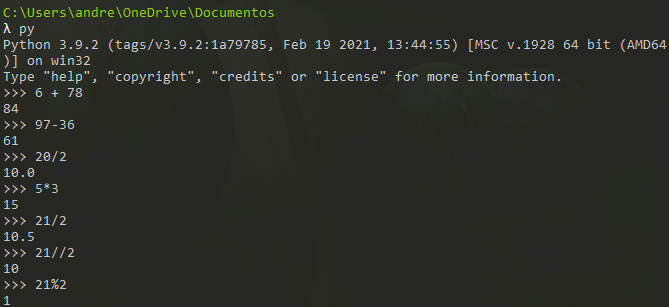

## Variables y Tipos de datos
**Variable** hace referencia a un objeto que reside en la memoria. El objeto puede ser de alguno de los tipos vistos (número o cadena de texto), o alguno de los otros tipos existentes en Python.

Cada variable debe tener un nombre único llamado identificador. Eso es muy de ayuda pensar las variables como contenedores que contienen data el cual puede ser cambiado después a través de técnicas de programación.


Los tipos de datos mas comunes o primitivos son:

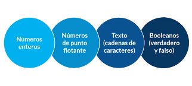

Tipos de datos en Python:

- Text Type: str
- Numeric Types: int, float, complex
- Sequence Types: list, tuple, range
- Mapping Type: dict
- Set Types: set, frozenset
- Boolean Type: bool
- Binary Types: bytes, bytearray, memoryview


## Convertir un dato en un tipo diferente de dato

- **input("")** para pedirle al usuario que introduzca datos.
- **int()** con datos o variables dentro de parentesis para convertirlo en número entero.
- **str()** para convertir números tanto decimales como enteros a strings.

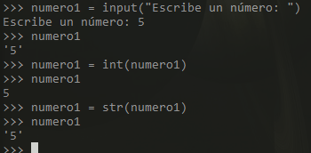

## Operadores lógicos y de comparación
- **and** para comparar si dos valores son verdaderos.
- **or** cuando quieres saber si al menos una de tus variables cuenta con los requisitos que buscas.
- **not** para invertir el valor booleano.
- **==** compara dos valores y te dice si son iguales o no.
- **!=** Compara dos valores y te dice sin son diferentes o no.
- **>** Compara si es mayor que otro valor.
- **<** Compara si es menor que otro valor.
- **>=** igual o mayor que el valor a comparar.
- **<=** igual o menor que el valor a comparar.


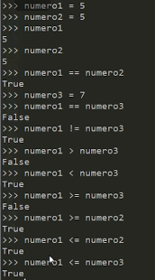

## Primer programa: Convertir moneda local a dólares
Para el primer programa se hará un conversor de moneda local a dólares para esto se crea el archivo **conversor.py** y se abre por medio de **VS Code** para editarlo, primero declaramos la variable pesos que recibirá el valor en COP que el usuario quiere pasar a USD (Lo escrito despues de un **#** hace refencia a un comentario, no lo leerá el programa al ser ejecutado):
```python
pesos = input("¿Cuantos pesos colombianos tienes?: ")
pesos = float(pesos) #De tipo flotante para que acepte decimales
valor dolar = 3668
dolares = pesos / valor_dolar
dolares = round(dolares, 2) #Función para redondear con 2 decimales
dolares = str(dolares) #Pasa a ser texto para imprimir respuesta
print("Tienes $" + dolares + " dólares")
```
Al ejecutarlo en nuestra terminal **Cmder** utilizando el comando **py** y luego el nombre del achivo nos arroja los siguientes resultados:


# Herramientas para programar

## Condicionales
La diferencia entre **if, elif y else**, y también el tema de hacer comentarios en el código.
- **if:** Con el ejemplo del código de esta clase: **if opcion == 1**. Aquí, si lo “traducimos”, sería “Si el usuario elige la opción 1, entonces…” y luego viene todo el código por debajo que conocemos como bloque de código.
- **else:** Si se desea ejecutar otro código en caso de que no se cumpla el if. Ósea, si por ejemplo, el usuario no elige la opción 1, entonces (else)…
- **elif:** Se utiliza cuando utilizamos múltiples condiciones, lo que en el código de esta clase son la opción 2 y 3. En esta clase, teníamos la opción 1, pero debemos también evaluar qué pasa si el usuario elige la opción 2 o 3, por lo que decimos “que estamos evaluando múltiples condiciones”.

Ejemplo 1: Un programa para saber si un número dado por el usuario es mayor, menor o igual a 5.

```python
numero = int(input("Escribe un numero: "))
if numero > 5:
    print("Es mayor a 5")
elif numero == 5:
    print("Es igual a 5")
else:
    print("Es menor a 5")
```
Ejemplo 2: Programa para saber si al ingresar la edad del usuario será mayor o menor de edad:

```python
edad = int(input("Escribe tu edad: "))
if edad > 17:
    print("Eres mayor de edad")
else:
    print("Eres menor de edad")
```
**Comentarios en Python:**

Para realizar un comentario (de una sola línea), utilizamos el “#”. Un comentario es simplemente texto, el cual no es ejecutado y no afecta en absoluto en el código. Se utiliza para explicar las líneas de código. Para qué veas cómo se utiliza, mira este ejemplo:
`dolar = str(dolar) #Convierte el resultado (número) en un string.`

## Mejora de conversor con condicionales

Teniendo en cuenta el uso de condicionales podemos mejorar un poco nuestro conversor de moneda y tambien agregar un menú para que el usuario escoja la moneda que quiere cambiar a dolares:

```python
menu = """  
Bienvenido al conversor de monedas  👌💰📈

1 - Pesos colombianos 
2 - Pesos argetinos
3 - Pesos mexicanos

Elige una opción: """

opcion = int(input(menu))

if opcion == 1:
    pesos = input("¿Cuantos pesos colombianos tienes?: ")
	pesos = float(pesos)
	valor dolar = 3668
	dolares = pesos / valor_dolar
	dolares = round(dolares, 2)
	dolares = str(dolares)
	print("Tienes $" + dolares + " dólares")
elif opcion == 2:
    pesos = input("¿Cuantos pesos argentinos tienes?: ")
	pesos = float(pesos)
	valor dolar = 91.64
	dolares = pesos / valor_dolar
	dolares = round(dolares, 2)
	dolares = str(dolares)
	print("Tienes $" + dolares + " dólares")
elif opcion == 3:
    pesos = input("¿Cuantos pesos mexicanos tienes?: ")
	pesos = float(pesos)
	valor dolar = 20.59
	dolares = pesos / valor_dolar
	dolares = round(dolares, 2)
	dolares = str(dolares)
	print("Tienes $" + dolares + " dólares")
else:
    print("Ingresa una opción correcta por favor")
```
## No repetir código con funciones

Una **función** es un bloque de código con un nombre asociado, que recibe cero o más argumentos como entrada, sigue una secuencia de sentencias, la cuales ejecuta una operación deseada y devuelve un valor y/o realiza una tarea, este bloque puede ser llamados cuando se necesite. Para crear una función se utiliza el comando **def** y el nombre de la función.

El uso de funciones es un componente muy importante del paradigma de la programación llamada estructurada, y tiene varias ventajas:

- **Modularización:** permite segmentar un programa complejo en una serie de partes o módulos más simples, facilitando así la programación y el depurado.
- **Reutilización:** permite reutilizar una misma función en distintos programas.

Ejemplo: La función de una resta con los argumentos a y b.

```python
>>> def resta(a, b):
	return a - b

>>> resta(30, 10)
20
```

## Modularizando nuestro conversor de monedas

Aplicando el concepto anterior de función se logra reemplazar algunas lineas de código en el programa de conversor al modularizarlo:

```python
def conversor(tipo_pesos, valor_dolar):
    pesos = input("¿Cuantos pesos " + tipo_pesos + " tienes?: ")
    pesos = float(pesos)
    dolares = pesos / valor_dolar
    dolares = round(dolares, 2)
    dolares = str(dolares)
    print("Tienes $" + dolares + " dólares")


menu = """  
Bienvenido al conversor de monedas  👌💰📈

1 - Pesos colombianos 
2 - Pesos argetinos
3 - Pesos mexicanos

Elige una opción: """

opcion = int(input(menu))

if opcion == 1:
    conversor("colombiano", 3875)
elif opcion == 2:
    conversor("argetinos", 91.64)
elif opcion == 3:
    conversor("mexiacanos", 20.59)
else:
    print("Ingresa una opción correcta por favor")
```

## Cadenas de carácteres y funciones Built-in

Algunas funciones que nos ayudan a trabajar con texto o cadenas de carácteres:

- **variable.upper():** Todos los caracteres en MAYÚSCULAS.
- **variable.capitalize():** Solo la primera en MAYÚSCULA.
- **variable.lower()** Todos los caracteres en minúscula.
- **variable.strip()** Eliminar espacios basura del string.
- **variable.replace(carácter a cambiar, carácter por poner)** Remplazar carácter.
- **variable[x]** Traer el carácter número x.
- **len()** Cantidad de caracteres de la variable.

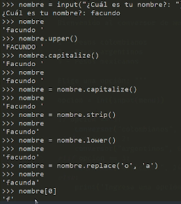

### Funciones Built-in

El intérprete de Python tiene una serie de funciones y tipos incluidos en él que están siempre disponibles, solo requiere que las invoquemos. Están listados aquí en orden alfabético.


## Slices o rebanadas

Los slices, traducidos al español como “rebanadas", nos permiten dividir los caracteres de un string de múltiples formas.
El formato completo de la rebanada es: **[start : end : step]**, usualmente solo usamos start y end.

Ejemplo:

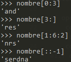

## Proyecto: palíndromo

El objetivo de este programa es que el usuario ingrese una palabra y este diferencie si es o no un **palindromo**. Un palindromo es una palabra o frase que se lee igual de izquierda a derecha que de derecha a izquierda. Por ejemplo:  reconocer, robador, rallar, etc.

**if __name__ == "__main__": 
run()**

La línea anterior es el punto de entrada  o "entry point" de un programa de Python. Una vez que se encuentra Python con esta línea de código, empieza a ejecutar todo lo qué esté abajo, cómo en este ejemplo, la función "run".

```python
def palindromo(palabra):
    palabra = palabra.replace(" ", "") #Reemplazar caracter
    palabra = palabra.lower() #Cambiar a minusculas
    palabra_invertida = palabra[::-1]
    if palabra == palabra_invertida:
        return True
    else:
        return False


def run():
    palabra = input("Escribe una palabra: ")
    es_palindromo = palindromo(palabra)
    if es_palindromo == True:
        print("Es palíndromo")
    else:
        print("No es un palíndromo")

if __name__ == "__main__": #Punto de entrada para correr run()
    run()
```

Al ejecutarlo en la terminal se obtienen los siguientes resultados:


# Bucles

Los bucles son otra herramienta para alterar el flujo normal de un programa. Nos permiten repetir una porción de código tantas veces como queramos. Python incluye únicamente dos tipos de bucle: while y for.

## Ciclo while

La palabra reservada while ejecuta una porción de código una y otra vez hasta que la condición especificada sea falsa; o, dicho de otro modo, ejecuta una porción de código mientras que la condición sea verdadera.
A menera de ejemplo se realiza un programa que muestre el resultado de elevar el número 2 con los exponenetes de 0 a 1000000:

```python
def run():
    LIMITE = 1000000

    contador = 0
    potencia_2 = 2**contador
    while potencia_2 < LIMITE:
        print("2 elevado a " + str(contador) + " es igual a: " + str(potencia_2))
        contador = contador + 1
        potencia_2 = 2**contador

if __name__ == "__main__":
    run()
```

Al ejecutarlo en la terminal se obtienen los siguientes resultados:

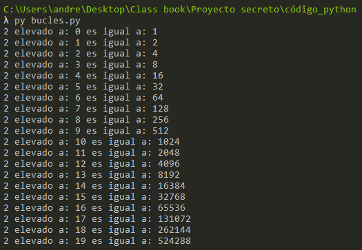

## Ciclo for

El bucle for se utiliza para recorrer los elementos de un objeto iterable (lista, tupla, conjunto, diccionario, …) y ejecutar un bloque de código. En cada paso de la iteración se tiene en cuenta a un único elemento del objeto iterable, sobre el cuál se pueden aplicar una serie de operaciones.
Para probar el concepto se realiza las diferencias entre imprimir números del 1 al 1000 de diferentes formas, siendo el ciclo for la mejor y mas corta manera:

```python
#Diferencias entre hacer una lista, un ciclo while y un ciclo for:

# a = list(range(1000))
# print(a)

# contador = 1
# print(contador)
# while contador < 1000:
#     contador += 1
#     print(contador)

# for contador in range(1, 1001):
#     print(contador)

for i in range(10):
    print(11 * i)
```


## Recorrer un string con un ciclo for

En este ejemplo se utiliza el ciclo for para recorrer el string de una entrada, procesarlo como mayúscula caracter por caracter:

```python
def run():
    # nombre = input("Escribe tu nombre: ")
    # for letra in nombre:
    #     print(letra)

    frase = input("Escribe una frase: ")
    for caracter in frase:
        print(caracter.upper())

if __name__ == "__main__":
    run()
```


## Interrumpiendo ciclos con comandos break y continue

Es posible alterar la iteración de los bucles en Python. Para ello, nos valdremos de las sentencias **break** y **continue**. Pero, ¿qué hacen estas sentencias?

- **break** se utiliza para finalizar y salir el bucle, por ejemplo, si se cumple alguna condición.
- Por su parte, **continue** salta al siguiente paso de la iteración, ignorando todas las sentencias que le siguen y que forman parte del bucle.

```python
def run():
    # for contador in range(1000): #imprimir numeros pares hasta 1000
    #     if contador % 2  != 0: # termino para decir diferente "!="
    #         continue
    #     print(contador)
    
    # for i in range(10000): #imprimir hasta que llegue al 5678
    #     print(i)
    #     if i == 5678:
    #         break

    texto = input("Escribe un texto:  ") #imprimir hasta que encuentre letra "o"
    for letra in texto:
        if letra == "o":
            break
        print(letra)

if __name__ == "__main__":
    run()
```
Primer bloque:

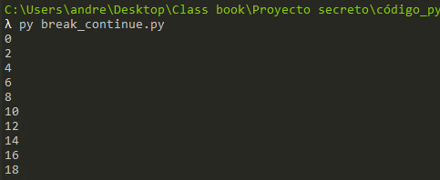

Segundo bloque:

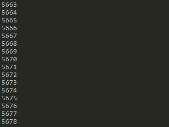

Tercer bloque:

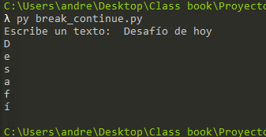

## Proyecto: Prueba de primalidad

Los números primos son aquellos que solo son divisibles entre ellos mismos y el 1, es decir, que si intentamos dividirlos por cualquier otro número, el resultado no es entero. Dicho de otra forma, si haces la división por cualquier número que no sea 1 o él mismo, se obtiene un resto distinto de cero.


Es necesario programar un código que verifique una entrada del usuario y realice la prueba si es o no un número primo:

```python
def es_primo(numero):
    contador = 0

    for i in range(1, numero + 1):
        if i == 1 or i == numero:
            continue
        if numero % i == 0:
            contador += 1
    if contador == 0:
        return True
    else:
        return False

def run():
    numero = int(input("Escribe un número:  "))
    if es_primo(numero):
        print("Es primo")
    else:
        print("No es primo")

if  __name__  == "__main__":
    run()
```


### Reto

Mejorar el código de prueba de primalidad:

```python
def es_primo(numero):
    contador = 0

    if numero <= 1:
        return False

    for i in range(1, numero + 1):
        if i == 1 or i == numero:
            continue
        if numero % i == 0:
            contador += 1
            break
    if contador == 0:
        return True
    else:
        return False

def run():
    numero = int(input("Escribe un número:  "))
    if es_primo(numero):
        print(str(numero) + " Es primo")
    else:
        print(str(numero) + " No es primo")

if  __name__  == "__main__":
    run()
```

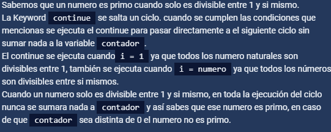

## Proyecto: Videojuego adivinar número

Para este proyecto se requiere un programa donde el usuario tenga varios intentos para adivinar un número entre 1 y 100 hasta ganar, es necesario utilizar bucles y comparativos para desarrollarlo.

```python
import random # Módulo para números aleatorios

def run():
	numero_aleatorio = random.randint(1, 100) #Aleatorio entre 1 y 100
	numero_elegido = int(input("Elige un número del 1 al 100: "))
	while numero_elegido != numero_aleatorio: #Mientras x sea diferente a y
		if numero_elegido < numero_aleatorio:
			print("Busca un número más grande")
		else:
			print("Busca un número más pequeño")
		numero_elegido = int(input("Elige otro número"))
	print("¡Gracias!")

if __name__ == "__main__":
	run()
```

Al ejecutarlo en la terminal se obtienen los siguientes resultados:

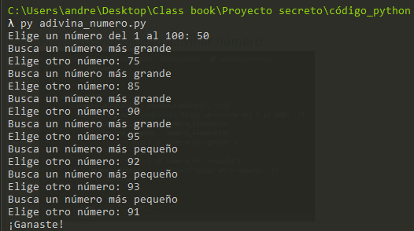

# Estructuras de datos

## Almacenar varios valores en una variable: listas

Entre las secuencias, el más versátil es la lista, para definir una se debe escribir es entre corchetes, separando sus elementos con comas cada uno.

La lista en Python son variables que almacenan arrays, internamente cada posición puede ser un tipo de datos distinto.

Las listas en Python son:

- **heterogéneas:** pueden estar conformadas por elementos de distintos tipo, incluidos otras listas.
- **mutables:** sus elementos pueden modificarse.
Una lista en Python es una estructura de datos formada por una secuencia ordenada de objetos.

Los elementos de una lista pueden accederse mediante su índice, siendo 0 el índice del primer elemento.

Definir una variable con varios tipos de datos (Lista): **["Hola", 2, 4.5, True]**
Agregar dato a lista: **variable.append(False)**
Eliminar dato de la lista: **variable.pop(1)** -> Elimina posición 1 (El 2)

Recorrer e imprimir:
```python
>>> for elemento in objetos:
	print(elemento)

#Permite sumar y operar listas ya que son dinámicas

```
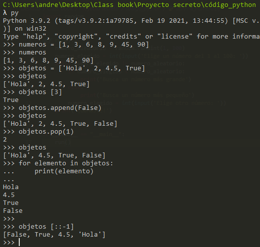


## Entendiendo cómo funcionan las tuplas 

Las tuplas son objetos de tipo secuencia, específicamente es un tipo de dato lista inmutable. Esta no puede modificarse de ningún modo después de su creación.
Son muy similares a las listas y comparten varias de sus funciones y métodos integrados, aunque su principal diferencia es que son inmutables.

Para convertir a tipos tuplas debe usar la función **tuple()**, la cual está integrada en el interprete Python.

Definir una variable con varios tipos de datos **(Tupla): (1, 2, 3, 4, 5)**
Comandos como **.append()** y **.pop()** no se pueden utilizar en tuplas.

Recorrer e imprimir:
```python
for numero in mi_tupla:
	print(numero)

# No permite modificar son datos inmutables, pero permiten realizar ciclos de manera más eficiente (for)

```

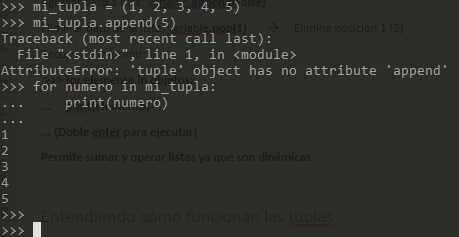

## Diccionarios

Son una estructura de datos mutable las cuales almacenan diferentes tipos de valores sin darle importancia a su orden. Identifican a cada elemento por una clave (Key). Se escriben entre {}.

Algunas de las operaciones que se pueden hacer con diccionarios:

- **.keys()** —> Retorna la clave de nuestro elemento
- **.values()** —> Retorna una lista de elementos (valores del diccionario)
- **.items()** —> Devuelve lista de tuplas (primero la clave y luego el valor)
- **.clear()** —> Elimina todos los items del diccionario
- **.pop(“n”)** —> Elimina el elemento ingresado

```python
def run():
    mi_diccionario = {
        "llave1" : 1,
        "llave2" : 2,
        "llave3" : 3,
    }

    # print(mi_diccionario['llave1']) #Se utiliza para imprimir cada llave con su valor
    # print(mi_diccionario['llave2'])
    # print(mi_diccionario['llave3'])

    poblacion_paises = {
        "Argentina" : 449388712,
        "Brasil" : 210147125,
        "Colombia" : 50372424
    }

    # print(poblacion_paises['Argentina']) # se utiliza para imprimir valro de Argentina

    # for pais in poblacion_paises.keys(): # imprimir nombre de las llaves
    #     print(pais)

    # for pais in poblacion_paises.values(): # imprimir valores de las llaves
    #     print(pais)

    for pais, poblacion in poblacion_paises.items(): # imprimir nombre y valor de las llaves de manera organizada
         print(pais + " Tiene " + str(poblacion) + " habitantes ")

if __name__ == "__main__":
    run()
```


## Proyecto final: generador de contraseñas

Como último proyecto de este curso se plantea desarrollar un programa que genere una contraseña con carácteres aleatorios, entre mayúsculas, minúsculas,  números y carácteres especiales, teniendo en cuenta todos lo conceptos vistos anteriormente.

```python
import random

def generar_contrasena(): #Listas con los carácteres 
    MAYUS = ['A', 'B', 'C', 'D', 'E', 'F', 'G', 'H', 'I', 'J', 'K', 'L', 'M', 'N', 'Ñ', 'O', 'P', 'Q', 'R', 'S', 'T', 'U', 'V', 'X', 'Y', 'Z']
    MINUS = ['a', 'b', 'c', 'd', 'e', 'f', 'g', 'h', 'i', 'j', 'k', 'l', 'm', 'n', 'ñ', 'o', 'p', 'q', 'r', 's', 't', 'u', 'v', 'x', 'y', 'z']
    NUMS = ['1', '2', '3', '4', '5', '6', '7', '8', '9', '0']
    CHARS = ['*', '+', '-', '/', '@', '_', '?', '!', '[', '{', '(', ')', '}', ']', ',', ';', '.', '>', '<', '~', '°', '^', '&', '$', '#', '"']

    caracteres = MAYUS + MINUS + NUMS + CHARS

    contrasena = [] #Lista donde se alamacenará la contraseña

    for i in range(15):
        caracter_random = random.choice(caracteres) #Elige un valor aleatorio de las listas
        contrasena.append(caracter_random) 
    
    contrasena = ''.join(contrasena) #Convierte en lista
    return contrasena

def run():
    contrasena = generar_contrasena()
    print('Tu nueva contraseña es: ' + contrasena)

if __name__ == "__main__":
    run()
```

Al ejecutarlo en la terminal se obtienen los siguientes resultados:


## Bonus: Atajos
- Link de atajos: [VS Code Atajos](https://filisantillan.com/blog/vscode-atajos/ "VS Code Atajos")
- Cambiar tema de colores en VS Code: **Crtl+K Crtl+T**
- Hacer comentario en VS Code: **Crtl+K Crtl+C**
- Recorte: **Windows+Shift+S**
